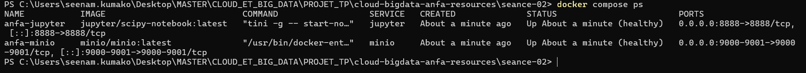

# Rendu — Séance 2

**Nom et prénom :** _À compléter_
**Identifiant GitHub :** _À compléter_
**Date de soumission :** _JJ/MM/AAAA_

---

## Résumé de la séance

Durant cette séance, j'ai écrit un `Dockerfile` pour conteneuriser un script PySpark
qui analyse le référentiel ANFA (lignes, arrêts, bus, tarifs). J'ai construit l'image
`anfa-analyse:v1`, observé le mécanisme de cache de Docker, puis orchestré un stack
à 3 services (MinIO, Jupyter, image custom) avec Docker Compose. Enfin, j'ai créé
un notebook Jupyter qui lit les données directement depuis le bucket MinIO via boto3.

---

## Étapes principales

1. **Écriture du Dockerfile** et construction de l'image `anfa-analyse:v1`
   (taille observée : ~1.2 Go — Java + PySpark).
2. **Mise en place du `.dockerignore`** et observation du cache Docker :
   seule la couche `COPY . .` est rejouée quand le code change,
   `pip install` reste en cache.
3. **Écriture du `docker-compose.yml`** orchestrant MinIO (stockage S3),
   Jupyter (notebook interactif) et notre image custom (script batch).
4. **Création du notebook `exploration_minio.ipynb`** qui liste les objets
   du bucket `anfa-raw` et analyse les données via boto3 et pandas.

---

## Captures d'écran

### `docker compose ps`



### Notebook Jupyter — DataFrame lignes et analyse


---

## Réponses aux questions du TP

### Pourquoi copier `requirements.txt` avant `COPY . .` ?

Docker crée une couche par instruction. Si on copie tout le code d'abord (`COPY . .`)
puis on fait `pip install`, n'importe quelle modification du code (même un print)
invalide la couche `pip install` et force une réinstallation complète de PySpark
(300+ Mo). En copiant `requirements.txt` séparément d'abord, la couche `pip install`
n'est invalidée que si les dépendances changent réellement.

**Anti-pattern à éviter :**
```dockerfile
# ❌ MAUVAIS — pip install refait à chaque changement de code
COPY . .
RUN pip install -r requirements.txt
```

**Bonne pratique :**
```dockerfile
# ✅ CORRECT — pip install en cache tant que requirements.txt ne change pas
COPY requirements.txt .
RUN pip install -r requirements.txt
COPY . .
```

### Pourquoi `anfa-app` est `Exited (0)` dans `docker compose ps` ?

Le script `analyse_referentiel.py` est une application **batch** : il s'exécute,
affiche ses résultats, puis se termine proprement. `Exited (0)` signifie
"terminé avec succès" (code de sortie 0). Ce comportement est intentionnel —
c'est pourquoi on a `restart: "no"` dans le compose.

### Pourquoi utiliser `http://minio:9000` et non `http://localhost:9000` depuis Jupyter ?

Les conteneurs Docker ne partagent pas le même espace réseau. `localhost` dans
le conteneur Jupyter pointe vers lui-même, pas vers MinIO. Docker Compose crée
un réseau interne (`anfa-net`) et expose chaque service par son **nom de service**
comme entrée DNS. Depuis Jupyter, MinIO est donc accessible via `http://minio:9000`.

### Rôle de `depends_on` avec `condition: service_healthy`

`depends_on` simple attend uniquement que le processus du service soit démarré,
pas qu'il soit prêt à répondre. Avec `condition: service_healthy`, Jupyter attend
que le healthcheck de MinIO passe (vérification que l'API S3 répond) avant de
démarrer. Cela évite les erreurs de connexion au démarrage.

---

## Bonus multi-stage (optionnel)

Construction de l'image multi-stage :

```bash
docker build -f Dockerfile.multistage -t anfa-analyse:v2-multistage .
docker images | grep anfa-analyse
```

| Image | Taille |
|---|---|
| `anfa-analyse:v1` | ~1.20 Go |
| `anfa-analyse:v2-multistage` | ~1.00 Go |

**Gain observé : ~200 Mo (≈ 17%).**

> Note pédagogique : le gain est modeste pour PySpark car Java (JRE) est une
> dépendance runtime incontournable, impossible à supprimer dans le stage final.
> Pour des apps compilées (Go, Rust), on peut tomber de 1 Go à moins de 20 Mo.

---

## Difficultés rencontrées

- **MinIO unhealthy** : le healthcheck `curl` n'était pas disponible dans certaines
  versions de l'image MinIO. Solution : s'assurer d'utiliser `minio/minio:latest`
  ou remplacer par `["CMD", "mc", "ready", "local"]`.
- **Notebook connexion refusée** : j'avais utilisé `localhost:9000` au lieu de
  `minio:9000`. Corrigé après lecture du message d'erreur.
- **Première construction** : le téléchargement de PySpark (300+ Mo) et de
  l'image Jupyter (1.5 Go) a pris plusieurs minutes. Les builds suivants
  étaient quasi instantanés grâce au cache.
