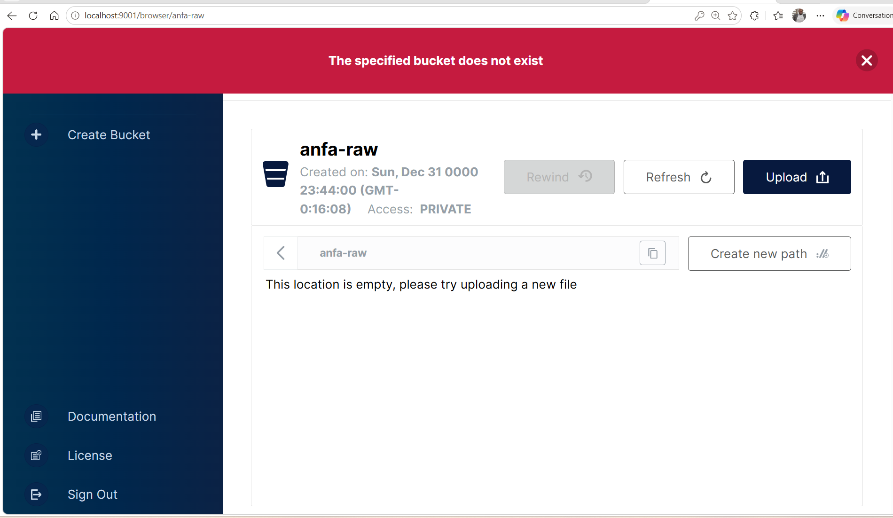
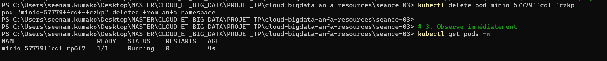

# Rendu Séance 3

**Nom et prénom :** _À compléter_
**Identifiant GitHub :** _À compléter_
**Date de soumission :** _JJ/MM/AAAA_

---

## Résumé de la séance

Durant cette séance, j'ai installé Kind et kubectl, puis créé un cluster Kubernetes
local nommé `anfa` tournant dans des conteneurs Docker. J'ai créé un namespace dédié
`anfa`, déployé MinIO via 3 manifestes YAML (PersistentVolumeClaim, Deployment, Service),
observé le self-healing en supprimant un pod recréé automatiquement, scalé le Deployment
de 1 à 3 replicas, puis activé l'Ingress Controller nginx.

---

## Étapes principales

1. Installation de Kind et kubectl, création du cluster `anfa`.
2. Création du namespace `anfa` et configuration de kubectl.
3. Déploiement de MinIO via 3 manifestes YAML (PVC, Deployment, Service).
4. Observation du self-healing après suppression manuelle d'un pod.
5. Scaling du Deployment de 1 à 3 replicas, puis retour à 1.
6. Activation de l'Ingress Controller nginx.

---

## Captures d'écran

### Console MinIO accessible via port-forward

### Self-healing observé

### Scaling à 3 replicas

---

## Réponses aux questions du TP

### Pourquoi le nœud Kubernetes apparaît-il dans `docker ps` ?

Kind (Kubernetes IN Docker) fait tourner le nœud Kubernetes **dans un conteneur Docker**
basé sur l'image `kindest/node`. Ce conteneur unique contient à la fois le Control Plane
et le Worker. C'est une démonstration que Kubernetes orchestre des conteneurs, mais peut
lui-même tourner dans un conteneur : la conteneurisation est partout.

### Pourquoi les composants du Control Plane apparaissent dans `kubectl get pods` ?

Les composants du Control Plane (API Server, etcd, Scheduler, Controller Manager) sont
eux-mêmes des **pods Kubernetes** qui tournent dans le namespace `kube-system`.
Kubernetes se gère lui-même : ses propres briques sont déployées comme des pods.

### Qu'est-ce que le self-healing et comment l'a-t-on observé ?

Après avoir supprimé manuellement le pod MinIO avec `kubectl delete pod`, le Deployment
a remarqué un écart entre l'état souhaité (1 replica) et l'état observé (0 pod). Il a donc
recréé automatiquement un nouveau pod, sans intervention de ma part. C'est le self-healing :
si un pod tombe à 3h du matin, Kubernetes le relance tout seul.

### Comment fonctionne le scaling avec Kubernetes ?

Avec `kubectl scale deployment minio --replicas=3`, on déclare l'état souhaité (3 copies).
Kubernetes crée immédiatement les pods manquants. À l'inverse, `--replicas=1` supprime les
pods en trop. On décrit l'état voulu, K8s se charge de l'atteindre (approche déclarative).

### Qu'est-ce qu'un PersistentVolumeClaim et pourquoi le statut `Bound` ?

Le PVC est une **demande de stockage** persistant. Le statut `Bound` signifie que Kubernetes
a trouvé un PersistentVolume pour satisfaire cette demande. Kind fournit un provisioner local
(`standard` StorageClass) qui crée les volumes automatiquement. Le PVC survit aux suppressions
de pods, donc les données MinIO persistent.

### Rôle de l'Ingress Controller

L'Ingress Controller nginx est lui-même un pod (dans le namespace `ingress-nginx`). Dans un
vrai déploiement, on définirait des ressources Ingress qui lui diraient comment router les
requêtes HTTP vers les bons Services (ex : `anfa.lome/console` → Service MinIO console).

---

## Difficultés rencontrées

- **NodePort non accessible depuis l'hôte avec Kind** : par défaut le NodePort de Kind
  n'est pas exposé. J'ai utilisé `kubectl port-forward service/minio 9001:9001` (et 9000)
  dans des terminaux séparés pour accéder à la console.
- **`kubectl port-forward` se ferme après inactivité** : il a fallu relancer la commande,
  ce qui est normal en développement.
- **`kubectl wait` sur l'Ingress Controller en timeout** : l'image était encore en cours
  de téléchargement. Ce n'était pas une vraie panne, j'ai relancé la commande `kubectl wait`
  après vérification de `kubectl get pods -n ingress-nginx`.
