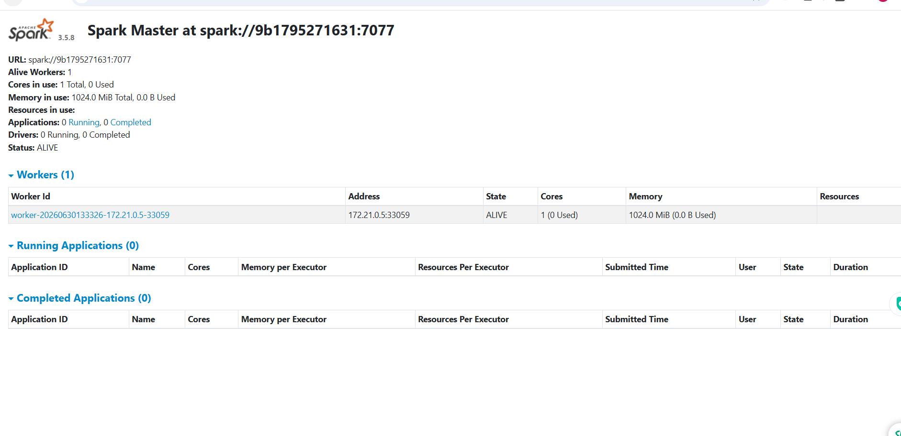
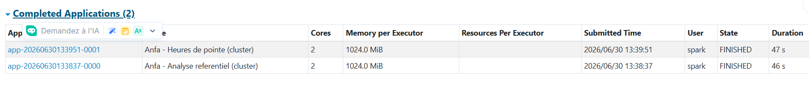
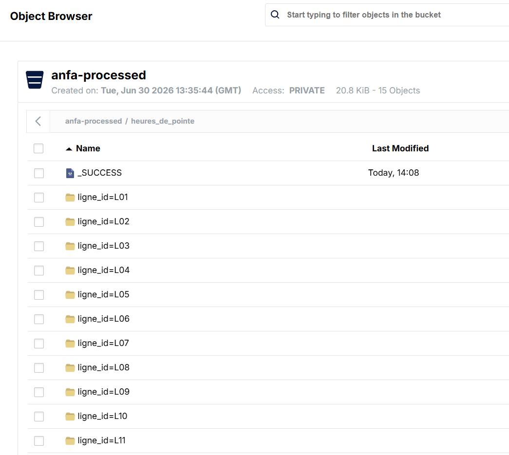

# Rendu Séance 5

**Nom et prénom :** Seenam Kumako

**Date :** 30 juin 2026

---

## Résumé de la séance

Déploiement d'un cluster Apache Spark standalone (1 master + 2 workers) via Docker Compose,
avec MinIO comme stockage objet S3-compatible. Exécution de deux jobs PySpark distribués :
analyse du référentiel de transport (bus, lignes, arrêts) et calcul des heures de pointe
à partir d'un historique simulé de ~8 964 trajets. Résultats écrits en Parquet dans MinIO.

---

## Étapes principales

1. Déploiement du cluster Spark standalone (1 master + 2 workers) via Docker Compose.
2. Préparation de MinIO : création des buckets `anfa-raw` et `anfa-processed`, clé applicative (`anfa-app-key`).
3. Upload du référentiel CSV dans MinIO (`upload_referentiel.py`) : 4 fichiers CSV dans `anfa-raw/referentiel/`.
4. Premier job distribué (`analyse_referentiel_cluster.py`) : statistiques de base sur les bus et lignes.
5. Génération d'un historique simulé de trajets (`generer_trajets.py`) : ~8 964 trajets sur 30 jours × 12 lignes.
6. Job d'analyse des heures de pointe (`heures_de_pointe.py`) : groupBy + shuffle + écriture Parquet partitionné.
7. Comparaison subjective entre mode local et mode cluster.

---

## Résultats du Job 1 — Analyse du référentiel

```
============================================================
  ANALYSE DU REFERENTIEL ANFA  CLUSTER
============================================================

Nombre de lignes          : 12
Nombre d'arrets uniques   : 60
Nombre total de bus       : 100
Dont actifs               : 93
Capacite totale flotte    : 6 280 places

Repartition des bus actifs par ligne :
+--------------+------+---------------+
|ligne_assignee|nb_bus|capacite_totale|
+--------------+------+---------------+
|L01           |13    |855            |
|L05           |11    |665            |
|L06           |10    |660            |
|L07           |10    |605            |
|L11           |9     |640            |
|L12           |8     |545            |
|L04           |6     |450            |
|L10           |6     |390            |
|L03           |6     |355            |
|L02           |6     |355            |
|L08           |5     |265            |
|L09           |3     |180            |
+--------------+------+---------------+

Analyse terminee en 49.7s.
```

---

## Résultats du Job 2 — Heures de pointe

```
Trajets analyses : 8 964

Top 10 des heures les plus chargees par ligne :
+--------+-----+----------+---------------+------------------+
|ligne_id|heure|nb_trajets|total_passagers|retard_moyen      |
+--------+-----+----------+---------------+------------------+
|L11     |18   |107       |4475           |3.40              |
|L05     |18   |105       |4787           |3.23              |
|L09     |18   |102       |4683           |3.44              |
|L01     |18   |102       |4316           |3.75              |
|L09     |17   |99        |4330           |2.94              |
|L03     |8    |97        |4683           |2.94              |
|L10     |8    |95        |4366           |3.01              |
|L10     |17   |93        |3858           |3.10              |
|L07     |8    |93        |4048           |2.58              |
|L02     |18   |93        |4056           |3.15              |
+--------+-----+----------+---------------+------------------+

Analyse terminee en 49.4s.
```

Les heures de pointe confirmées : **8h le matin** et **17h-18h le soir**, cohérent avec la distribution simulée.

---

## Captures d'écran

### Dashboard Spark Master avec 2 workers ALIVE


### Application Spark exécutée avec succès (Completed Applications)


### Résultats du Top 10 dans la console


### Bucket anfa-processed avec heures_de_pointe partitionné par ligne_id


---

## Réflexion : local vs cluster

| Critère | Mode local (`local[*]`) | Cluster (2 workers) |
|---|---|---|
| Temps observé (~9 000 trajets) | ~3-5 s | ~49 s |
| Overhead | Faible | Élevé (communication Driver ↔ Executors + S3A) |
| Utilisation RAM | Limitée à 1 machine | Distribuée sur les workers |
| Scalabilité | Limitée à 1 machine | Horizontale (ajouter des workers) |
| Intérêt | Développement, petits volumes | Production, volumes > RAM d'une machine |

**Conclusion :** Sur un petit volume (~9 000 lignes), le mode local est largement plus rapide (3-5s vs 49s)
car l'overhead réseau du cluster (communication Driver ↔ Executors, accès S3A à MinIO, coordination)
dépasse le gain du parallélisme. Le cluster devient indispensable dès que le volume dépasse la RAM
disponible sur une seule machine (typiquement à partir de quelques centaines de millions de lignes),
ou lorsque la tolérance aux pannes et la scalabilité horizontale sont requises en production.

---

## Bonus Spark sur Kubernetes

Réalisé : **non**

---

## Réponses aux exercices d'application

- **Pourquoi `SPARK_NO_DAEMONIZE=true` ?** Sans ce flag, le processus Spark se met en arrière-plan (daemon) et le conteneur Docker s'arrête immédiatement faute de processus au premier plan.
- **Pourquoi `-e HOME=/tmp` dans `docker exec` ?** L'image `apache/spark` tourne sous un utilisateur sans répertoire home défini (`/nonexistent`). `pip install --user` et le cache Maven Ivy ont besoin d'écrire dans `$HOME`. On redirige vers `/tmp` qui est accessible en écriture.
- **Qu'est-ce que le connecteur S3A ?** C'est l'implémentation Hadoop du protocole S3. Il permet à Spark de lire/écrire dans n'importe quel stockage objet compatible S3 (AWS S3, MinIO, etc.) via des URIs `s3a://`.
- **Pourquoi partitionner par `ligne_id` ?** Cela crée des sous-dossiers `ligne_id=L01/`, `L02/`... dans MinIO. Une requête filtrée sur une ligne spécifique ne lira que le sous-dossier correspondant (partition pruning), réduisant drastiquement les I/O.

---

## Difficultés rencontrées

- Sur Windows avec Git Bash, les chemins `/opt/jobs/` sont convertis en chemins Windows par le shell. Solution : utiliser PowerShell pour les commandes `docker exec`.
- `boto3` installé avec `pip install --user` n'est pas dans le PYTHONPATH par défaut de l'image. Solution : ajouter `PYTHONPATH=/tmp/.local/lib/python3.11/site-packages` lors de l'exécution.
