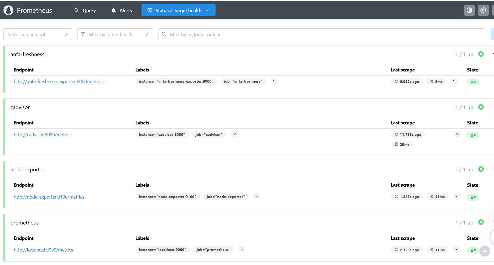
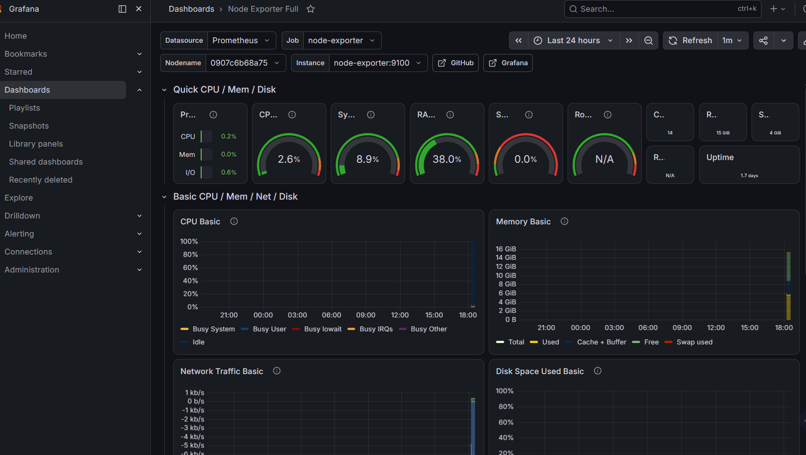
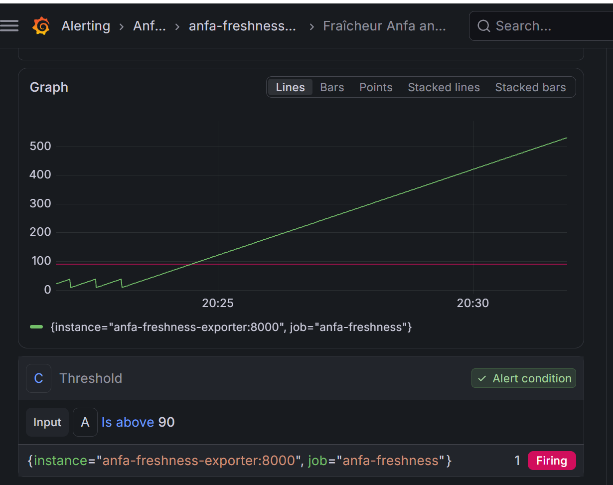

# Rendu — Séance 9

**Nom et prénom :** KUMAKO Seenam Kodjo
**Identifiant GitHub :** seenam
**Date de soumission :** 08/07/2026

## Résumé de la séance

Déploiement d'une stack de monitoring complète (Prometheus, Node Exporter, cAdvisor,
Grafana) et d'un exportateur métier custom simulant la fraîcheur des données Anfa.
Exploration des cibles Prometheus et de PromQL, import du dashboard "Node Exporter
Full", construction d'un panneau jauge dédié à la fraîcheur, configuration d'une
alerte Grafana et déclenchement de celle-ci via une panne simulée.

## Étapes principales

1. Déploiement de Prometheus, Node Exporter, cAdvisor, Grafana et d'un exportateur
   métier custom (fraîcheur des données Anfa).
2. Exploration des cibles Prometheus et premières requêtes PromQL.
3. Import du dashboard "Node Exporter Full" et construction d'un panneau custom.
4. Configuration d'une alerte Grafana sur la fraîcheur des données.
5. Simulation d'une panne silencieuse et observation du déclenchement de l'alerte.

## Captures d'écran

### Les 4 cibles Prometheus à l'état UP

### Dashboard "Node Exporter Full" importé

### Alerte à l'état Firing après panne simulée

## Réflexion personnelle

Cette séance illustre très concrètement la situation-problème d'Awa : pendant toute
la simulation de panne, `docker compose ps` affichait les 5 services `Up`, sans
aucune erreur dans les logs des autres conteneurs. Ni le CPU, ni la RAM, ni le statut
des conteneurs n'auraient permis de détecter que le pipeline avait cessé de produire
des résultats frais. Seule la métrique métier `anfa_dernier_traitement_timestamp`,
et la fraîcheur qui en découle, a révélé le problème : un processus qui tourne peut
très bien ne plus rien accomplir d'utile. Cela montre l'importance de métriques
métier en plus des métriques d'infrastructure classiques.

## Difficultés rencontrées

Le port 8000 par défaut de l'exportateur était déjà utilisé par un autre projet
local (conteneur `eventculture_api`). Résolu en remappant l'exportateur sur le port
hôte 8001 (`8001:8000`) dans `docker-compose.yml`, sans impact sur le scraping
interne par Prometheus qui continue de cibler `anfa-freshness-exporter:8000` sur le
réseau Docker.
