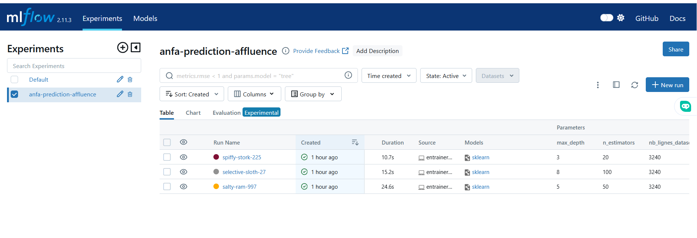
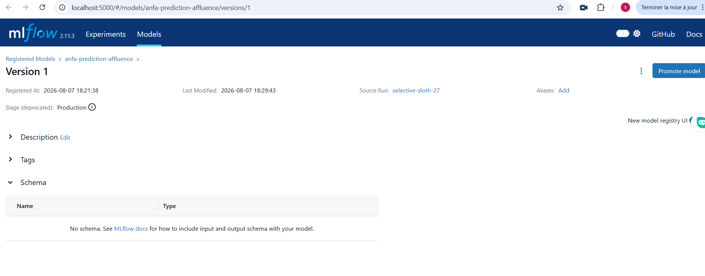

# Rendu — Séance 10

**Nom et prénom :** Sena Kumako
**Identifiant GitHub :** seenam
**Date de soumission :** 07/08/2026

## Résumé de la séance

Un serveur MLflow Tracking a été déployé via Docker Compose (SQLite pour les métadonnées,
stockage local pour les artefacts). Trois runs d'entraînement d'un modèle RandomForest
prédisant l'affluence par ligne ont été tracés avec des hyperparamètres différents, puis
comparés dans l'UI MLflow. Le meilleur run (n_estimators=100, max_depth=8, R²≈0.97) a été
enregistré dans le Model Registry et son statut basculé en Production. Une fiche de
conformité non-technique a été rédigée pour un scénario d'application mobile Anfa.

## Étapes principales

1. Déploiement d'un serveur MLflow Tracking (SQLite + stockage local).
2. Génération d'un jeu de données d'affluence Anfa et entraînement de 3 variantes
   d'un modèle RandomForest, chacune tracée avec MLflow.
3. Comparaison des runs dans l'UI et identification du meilleur candidat.
4. Enregistrement du modèle dans le Model Registry, transition en statut Production.
5. Rédaction d'une fiche de conformité pour un scénario d'application mobile Anfa.

## Captures d'écran

### Tableau des 3 runs comparés

### Modèle enregistré en statut Production

## Réflexion personnelle

Le Model Registry répond directement au problème de Kossi : au lieu de fichiers de modèles
ou de notebooks dispersés et nommés de façon ambiguë (ex. `test_v2_final.ipynb`), chaque
version est tracée, datée, comparable via ses métriques, et identifiable par un statut clair
(Production, Staging, Archived). Le code applicatif charge toujours "la version en
Production" sans connaître son numéro de run, exactement comme Terraform (séance 4)
permet de connaître et de reproduire l'état exact d'une infrastructure à partir d'un
fichier de state versionné plutôt que de configurations manuelles éparpillées : dans les
deux cas, on remplace une source de vérité informelle et fragile par un historique
explicite, reproductible et partageable en équipe.

## Difficultés rencontrées

Aucune difficulté majeure. Le principal point d'attention a été de bien s'assurer que le
serveur MLflow était lancé avec `--serve-artifacts` avant de lancer les entraînements,
sans quoi l'enregistrement du modèle dans le Registry aurait échoué.
